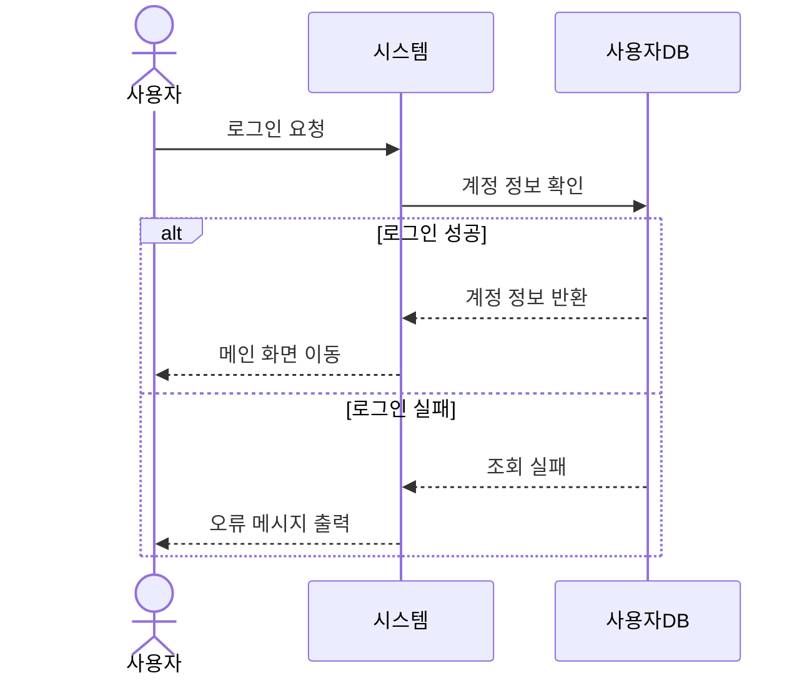
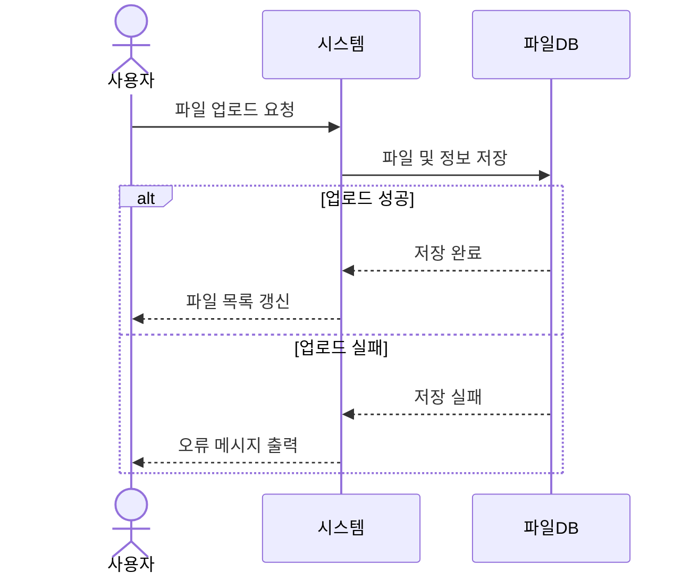
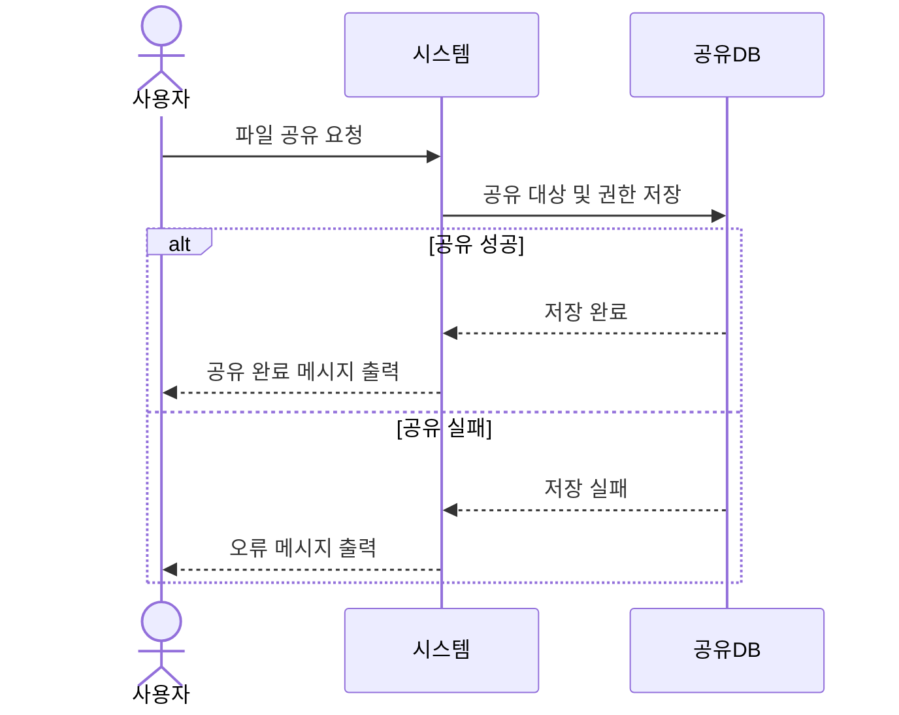
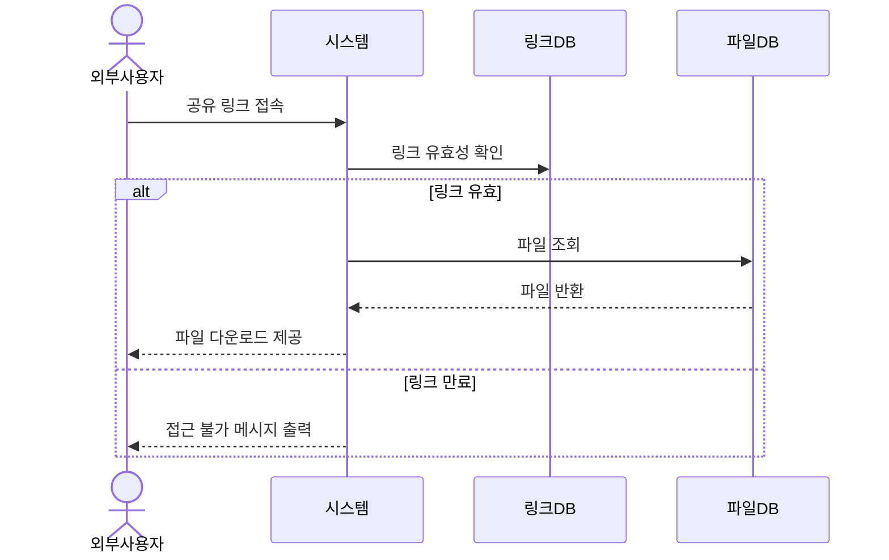

# 요구사항 분석서

## 1. 서론

### 1.1 목적 및 범위

본 문서는 클라우드 파일 공유 시스템 **Mini Drive**의 요구사항을 분석한 문서이다.  
Mini Drive는 조직 내부 사용자가 파일을 업로드하고, 폴더로 정리하며, 다른 사용자 또는 외부 협력자와 파일을 공유할 수 있도록 돕는 시스템이다.

본 문서에서는 Mini Drive의 주요 기능을 유스케이스, 클래스 구조, 순차 흐름 중심으로 정리한다.

### 1.2 용어 정의

| 용어 | 설명 |
|---|---|
| Mini Drive | 클라우드 기반 파일 저장 및 공유 시스템 |
| 사용자 | 파일을 업로드, 다운로드, 검색, 공유하는 조직 구성원 |
| 관리자 | 사용자 계정과 저장 공간을 관리하는 담당자 |
| 외부 사용자 | 공유 링크를 통해 파일에 접근하는 외부 협력자 |
| 공유 링크 | 외부 사용자에게 파일을 제공하기 위해 생성되는 링크 |
| 버전 관리 | 파일 수정 시 이전 버전을 보관하고 복원할 수 있게 하는 기능 |

### 1.3 참조 문서

- Customer Requirement Document v0.1
- 요구사항 정의서
- ch08 객체지향 분석 강의자료

---

## 2. 시스템 개요

### 2.1 Actor Table

| Actor | Role |
|---|---|
| 사용자 | 파일을 업로드, 다운로드, 검색, 공유하고 폴더를 관리한다 |
| 관리자 | 사용자 계정 생성/삭제와 저장 공간 관리를 담당한다 |
| 외부 사용자 | 공유 링크를 통해 허용된 파일에 접근한다 |
| 시스템 | 파일 저장, 권한 확인, 버전 저장, 링크 만료 처리를 수행한다 |

---

### 2.2 유스케이스 다이어그램

```mermaid
graph TD
    사용자((사용자))
    관리자((관리자))
    외부사용자((외부 사용자))
    시스템((시스템))

    사용자 --> U01[로그인]
    사용자 --> U02[파일 업로드]
    사용자 --> U03[파일 다운로드]
    사용자 --> U04[폴더 관리]
    사용자 --> U05[파일 검색]
    사용자 --> U06[파일 공유]
    사용자 --> U07[버전 관리]

    관리자 --> U08[사용자 계정 관리]
    관리자 --> U09[저장 공간 관리]

    외부사용자 --> U10[공유 링크 접근]

    시스템 --> U11[권한 확인]
    시스템 --> U12[버전 자동 저장]
    시스템 --> U13[공유 링크 만료 처리]
````

---

## 3. 요구사항 명세

### 3.1 주요 유스케이스 설명

| ID   | 유스케이스     | Actor    | 설명                             |
| ---- | --------- | -------- | ------------------------------ |
| U_01 | 로그인       | 사용자, 관리자 | 이메일과 비밀번호로 시스템에 로그인한다          |
| U_02 | 파일 업로드    | 사용자      | 사용자가 업무 파일을 시스템에 저장한다          |
| U_03 | 파일 다운로드   | 사용자      | 저장된 파일을 사용자 기기로 다운로드한다         |
| U_04 | 폴더 관리     | 사용자      | 폴더 생성, 이름 변경, 삭제, 파일 이동을 수행한다  |
| U_05 | 파일 검색     | 사용자      | 파일명, 날짜, 파일 유형 등을 기준으로 파일을 찾는다 |
| U_06 | 파일 공유     | 사용자      | 다른 사용자에게 파일을 공유하고 권한을 설정한다     |
| U_07 | 버전 관리     | 사용자      | 파일의 이전 버전을 확인하고 복원한다           |
| U_08 | 사용자 계정 관리 | 관리자      | 사용자 계정을 생성하거나 삭제한다             |
| U_09 | 저장 공간 관리  | 관리자      | 사용자별 저장 공간 사용량을 확인하고 제한한다      |
| U_10 | 공유 링크 접근  | 외부 사용자   | 공유 링크를 통해 허용된 파일에 접근한다         |

---

### 3.2 유스케이스 상세

#### U_01 로그인

사용자는 이메일과 비밀번호를 입력하여 시스템에 로그인한다.
시스템은 입력된 계정 정보를 확인하고, 정보가 올바르면 메인 화면으로 이동시킨다.

* 정상 흐름

  * 사용자가 이메일과 비밀번호를 입력한다.
  * 시스템이 계정 정보를 확인한다.
  * 로그인 성공 시 메인 화면으로 이동한다.

* 예외 흐름

  * 이메일 또는 비밀번호가 틀리면 로그인 실패 메시지를 출력한다.

---

#### U_02 파일 업로드

사용자는 업무에 필요한 파일을 Mini Drive에 업로드한다.
시스템은 파일을 저장하고, 파일명, 크기, 업로드 날짜 등의 정보를 함께 기록한다.

* 정상 흐름

  * 사용자가 업로드할 파일을 선택한다.
  * 시스템이 파일을 저장한다.
  * 파일 목록에 업로드된 파일이 표시된다.

* 예외 흐름

  * 파일 크기가 제한을 초과하면 업로드 실패 메시지를 출력한다.
  * 저장 공간이 부족하면 업로드할 수 없다.

---

#### U_03 파일 다운로드

사용자는 자신이 접근할 수 있는 파일을 다운로드한다.
시스템은 사용자의 권한을 확인한 뒤 파일을 제공한다.

* 정상 흐름

  * 사용자가 다운로드할 파일을 선택한다.
  * 시스템이 접근 권한을 확인한다.
  * 권한이 있으면 파일 다운로드를 제공한다.

* 예외 흐름

  * 권한이 없으면 다운로드할 수 없다는 메시지를 출력한다.

---

#### U_04 폴더 관리

사용자는 파일을 정리하기 위해 폴더를 생성하거나 수정할 수 있다.

* 정상 흐름

  * 사용자가 폴더 생성, 이름 변경, 삭제 중 하나를 선택한다.
  * 시스템이 변경 내용을 반영한다.

* 예외 흐름

  * 삭제하려는 폴더 안에 파일이 있으면 확인 메시지를 출력한다.

---

#### U_05 파일 검색

사용자는 파일명, 날짜, 파일 유형 등을 이용하여 필요한 파일을 검색한다.

* 정상 흐름

  * 사용자가 검색어 또는 조건을 입력한다.
  * 시스템이 조건에 맞는 파일 목록을 출력한다.

* 예외 흐름

  * 검색 결과가 없으면 결과 없음 메시지를 출력한다.

---

#### U_06 파일 공유

사용자는 특정 파일을 다른 사용자와 공유할 수 있다.
공유할 때 보기, 수정, 댓글 권한을 설정할 수 있다.

* 정상 흐름

  * 사용자가 공유할 파일을 선택한다.
  * 공유 대상과 권한을 설정한다.
  * 시스템이 공유 정보를 저장한다.

* 예외 흐름

  * 존재하지 않는 사용자를 입력하면 오류 메시지를 출력한다.

---

#### U_07 버전 관리

파일이 수정되면 시스템은 이전 버전을 저장할 수 있다.
사용자는 필요할 때 이전 버전을 확인하거나 복원할 수 있다.

* 정상 흐름

  * 사용자가 특정 파일의 버전 목록을 확인한다.
  * 복원할 버전을 선택한다.
  * 시스템이 해당 버전으로 복원한다.

* 예외 흐름

  * 저장된 버전이 없으면 버전 이력 없음 메시지를 출력한다.

---

#### U_08 사용자 계정 관리

관리자는 조직 구성원의 계정을 생성하거나 삭제한다.

* 정상 흐름

  * 관리자가 계정 관리 화면에 접속한다.
  * 사용자 정보를 입력하여 계정을 생성하거나 기존 계정을 삭제한다.

* 예외 흐름

  * 이미 존재하는 이메일로 계정을 생성하려 하면 오류 메시지를 출력한다.

---

#### U_09 저장 공간 관리

관리자는 사용자별 저장 공간 사용량을 확인하고 제한을 설정할 수 있다.

* 정상 흐름

  * 관리자가 저장 공간 관리 화면에 접속한다.
  * 사용자별 사용량을 확인한다.
  * 필요한 경우 저장 공간 제한을 변경한다.

* 예외 흐름

  * 잘못된 저장 공간 값을 입력하면 오류 메시지를 출력한다.

---

#### U_10 공유 링크 접근

외부 사용자는 공유 링크를 통해 파일에 접근한다.
시스템은 링크가 유효한지, 만료되지 않았는지 확인한다.

* 정상 흐름

  * 외부 사용자가 공유 링크에 접속한다.
  * 시스템이 링크 유효성을 확인한다.
  * 링크가 유효하면 파일 다운로드를 제공한다.

* 예외 흐름

  * 링크가 만료되었거나 잘못된 링크이면 접근 불가 메시지를 출력한다.

---

## 4. 정적 분석

### 4.1 클래스 다이어그램

```mermaid
classDiagram
    class 사용자 {
        -String 이메일
        -String 비밀번호
        -String 이름
        +로그인()
        +파일업로드()
        +파일다운로드()
        +파일검색()
    }

    class 관리자 {
        +계정생성()
        +계정삭제()
        +저장공간관리()
    }

    class 파일 {
        -Integer 파일ID
        -String 파일명
        -Integer 파일크기
        -Date 업로드일시
        +업로드()
        +다운로드()
        +삭제()
    }

    class 폴더 {
        -Integer 폴더ID
        -String 폴더명
        +생성()
        +이름변경()
        +삭제()
    }

    class 공유설정 {
        -Integer 공유ID
        -String 권한
        -Date 만료일
        +공유()
        +권한변경()
        +링크생성()
    }

    class 버전 {
        -Integer 버전ID
        -Date 수정일시
        +버전조회()
        +버전복원()
    }

    사용자 "1" --> "0..*" 파일 : 업로드
    사용자 "1" --> "0..*" 폴더 : 생성
    관리자 "1" --> "0..*" 사용자 : 관리
    폴더 "1" --> "0..*" 파일 : 포함
    파일 "1" --> "0..*" 공유설정 : 공유
    파일 "1" --> "0..*" 버전 : 버전관리
```

---

### 4.2 클래스 설명

| 클래스  | 설명                      |
| ---- | ----------------------- |
| 사용자  | Mini Drive를 사용하는 일반 사용자 |
| 관리자  | 계정과 저장 공간을 관리하는 사용자     |
| 파일   | 시스템에 저장되는 파일 정보         |
| 폴더   | 파일을 정리하기 위한 구조          |
| 공유설정 | 파일 공유 대상과 권한 정보         |
| 버전   | 파일의 이전 버전 정보            |

---

## 5. 동적 분석

### 5.1 로그인



---

### 5.2 파일 업로드



---

### 5.3 파일 공유



---

### 5.4 공유 링크 접근



---

## 6. 인터페이스 분석

| 화면        | 설명                           |
| --------- | ---------------------------- |
| 로그인 화면    | 이메일과 비밀번호를 입력하여 로그인하는 화면     |
| 파일 목록 화면  | 파일과 폴더 목록을 확인하는 메인 화면        |
| 파일 업로드 화면 | 파일을 선택하여 업로드하는 화면            |
| 파일 공유 화면  | 공유 대상과 권한을 설정하는 화면           |
| 검색 화면     | 파일명, 날짜, 파일 유형으로 파일을 검색하는 화면 |
| 버전 관리 화면  | 파일의 이전 버전을 확인하고 복원하는 화면      |
| 관리자 화면    | 계정과 저장 공간을 관리하는 화면           |

---

## 7. 제약사항

| 제약사항   | 내용                          |
| ------ | --------------------------- |
| 운영 환경  | 웹 브라우저에서 사용할 수 있어야 한다       |
| 사용자 규모 | 약 200명 정도의 조직 사용자를 고려한다     |
| 보안     | 로그인 인증과 권한 기반 접근 제어가 필요하다   |
| 파일 형식  | 일반적인 업무 파일 형식을 지원해야 한다      |
| 외부 공유  | 공유 링크에는 만료 기간을 설정할 수 있어야 한다 |
| 성능     | 파일 검색과 다운로드는 빠르게 동작해야 한다    |

---

## 8. 요구사항 추적표

| 요구사항             | U_01 | U_02 | U_03 | U_04 | U_05 | U_06 | U_07 | U_08 | U_09 | U_10 |
| ---------------- | ---- | ---- | ---- | ---- | ---- | ---- | ---- | ---- | ---- | ---- |
| FR-001 로그인       | O    |      |      |      |      |      |      |      |      |      |
| FR-002 파일 업로드    |      | O    |      |      |      |      |      |      |      |      |
| FR-003 파일 다운로드   |      |      | O    |      |      |      |      |      |      |      |
| FR-004 폴더 관리     |      |      |      | O    |      |      |      |      |      |      |
| FR-005 파일 검색     |      |      |      |      | O    |      |      |      |      |      |
| FR-006 파일 공유     |      |      |      |      |      | O    |      |      |      |      |
| FR-007 버전 관리     |      |      |      |      |      |      | O    |      |      |      |
| FR-008 계정 관리     |      |      |      |      |      |      |      | O    |      |      |
| FR-009 저장 공간 관리  |      |      |      |      |      |      |      |      | O    |      |
| FR-010 공유 링크 접근  |      |      |      |      |      |      |      |      |      | O    |
| NFR-001 로그인 인증   | O    |      |      |      |      |      |      |      |      |      |
| NFR-002 접근 권한 제어 | O    | O    | O    |      | O    | O    |      | O    | O    | O    |

---

## 9. 참고문헌

* 요구사항 정의서
* ch08 객체지향 분석 강의자료
