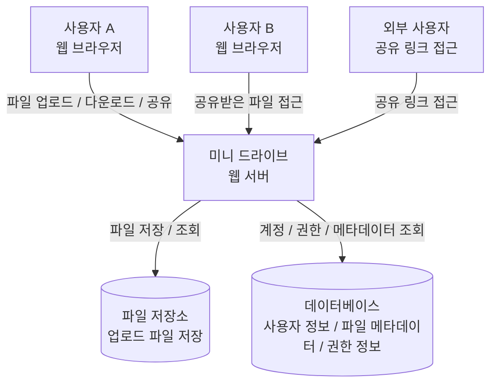

# 클라우드 파일 공유 시스템 테스트 결과 보고서

## 문서 정보

| 항목                | 내용                             |
| ----------------- | ------------------------------ |
| 프로젝트명             | 클라우드 파일 공유 시스템                 |
| 시스템명              | 미니 드라이브                        |
| 문서명               | 테스트 결과 보고서                     |
| 작성자               | 정유나                          |
| 작성일               | 2026-06-16                     |
| GitHub Repository | `https://github.com/ppomee2002/se` |

---

## 제/개정 이력

| 버전   | 날짜         | 작성자   | 제/개정 사항  | 비고             |
| ---- | ---------- | ----- | -------- | -------------- |
| v0.1 | 2026-06-16 | 정유나 | 최초 작성    |    |

---

# 1. 서론

## 1.1 문서 목적 및 범위

본 문서의 목적은 **클라우드 파일 공유 시스템(미니 드라이브)** 프로젝트의 요구사항을 바탕으로 테스트 대상을 정의하고, 기능별 테스트 항목과 테스트 케이스를 설계하는 데 있다.

본 프로젝트는 실제 구현이 완료되지 않았거나 일부 기능만 구현된 상태일 수 있으므로, 본 문서에서는 실제 테스트 수행 결과뿐 아니라 **구현 전 단계에서 수행 가능한 테스트 디자인**을 포함한다.

본 문서에서 다루는 범위는 다음과 같다.

* 파일 업로드 및 다운로드 기능
* 폴더 생성, 수정, 삭제 기능
* 파일 이동 및 삭제 복구 기능
* 파일 공유 및 공유 링크 기능
* 파일 검색 기능
* 파일 버전 관리 기능
* 사용자 계정 및 관리자 기능
* 보안 기능
* 성능 요구사항
* GitHub 업로드 및 팀원 리뷰 반영 내역

---

## 1.2 프로젝트 개요

미니 드라이브는 조직 내부에서 사용할 수 있는 클라우드 기반 파일 관리 및 협업 시스템이다.

기존에는 팀원들이 이메일, 메신저, 개인 클라우드 서비스를 이용해 문서와 자료를 공유했기 때문에 다음과 같은 문제가 있었다.

* 파일의 최신 버전을 확인하기 어렵다.
* 파일이 여러 경로에 분산되어 있어 검색 시간이 오래 걸린다.
* 외부 협력 업체와 파일을 공유할 때 접근 권한 관리가 어렵다.
* 조직 내부 자료가 외부로 유출될 위험이 있다.

이를 해결하기 위해 본 시스템은 파일을 중앙에서 관리하고, 사용자가 파일을 업로드·다운로드·검색·공유할 수 있는 기능을 제공한다.

---

## 1.3 용어 정의

| 용어    | 설명                                      |
| ----- | --------------------------------------- |
| 사용자   | 시스템에 로그인하여 파일을 업로드, 다운로드, 공유하는 일반 계정    |
| 관리자   | 사용자 계정 생성, 삭제, 저장 공간 관리 등을 수행하는 계정      |
| 파일    | 사용자가 업로드하는 문서, 이미지, PDF, 압축 파일, 영상 파일 등 |
| 폴더    | 파일을 체계적으로 분류하기 위한 저장 단위                 |
| 공유 링크 | 외부 사용자가 파일에 접근할 수 있도록 생성되는 URL          |
| 권한    | 파일에 대해 보기, 수정, 댓글 작성 등을 허용하는 접근 수준      |
| 버전    | 파일이 수정될 때 보관되는 이전 상태                    |
| 복구    | 삭제된 파일을 일정 기간 내 다시 사용할 수 있도록 되돌리는 기능    |

---

## 1.4 참조 문서

| 문서명                           | 버전   | 설명                     |
| ----------------------------- | ---- | ---------------------- |
| Customer Requirement Document | v0.1 | 클라우드 파일 공유 시스템 요구사항 문서 |
| 샘플 테스트결과 보고서                  | -    | 테스트 결과 보고서 작성 참고 문서    |

---

# 2. 테스트 개요

## 2.1 테스트 범위

본 테스트는 시스템 내부 구현 코드를 직접 확인하지 않고, 사용자의 관점에서 기능이 요구사항대로 동작하는지를 확인하는 **블랙박스 테스트** 방식으로 설계한다.

| 테스트 범위    | 내용                                     |
| --------- | -------------------------------------- |
| 파일 저장 기능  | 파일 업로드, 다운로드, 파일 메타데이터 저장 여부 확인        |
| 폴더 관리 기능  | 폴더 생성, 이름 변경, 삭제, 파일 이동 확인             |
| 파일 공유 기능  | 사용자 간 공유, 권한 설정, 공유 링크 생성 및 만료 확인      |
| 파일 검색 기능  | 파일 이름, 업로드 날짜, 업로드 사용자, 파일 유형 기준 검색 확인 |
| 버전 관리 기능  | 이전 버전 목록 확인, 다운로드, 복원 확인               |
| 사용자 계정 기능 | 로그인, 사용자 계정 생성·삭제, 저장 공간 관리 확인         |
| 보안 기능     | 인증, 권한 기반 접근 제어, 전송 암호화 확인             |
| 성능 기능     | 파일 검색 및 다운로드 응답 시간 확인                  |

---

## 2.2 테스트 항목 및 통과 기준

### 2.2.1 기능별 테스트 항목

| 기능별 테스트 항목  | 통과 기준                                |
| ----------- | ------------------------------------ |
| 파일 업로드      | 사용자가 선택한 파일이 정상적으로 서버에 저장된다.         |
| 파일 다운로드     | 사용자가 업로드한 파일을 다시 다운로드할 수 있다.         |
| 파일 메타데이터 저장 | 파일명, 업로드 날짜, 파일 크기 정보가 함께 저장된다.      |
| 폴더 생성       | 사용자가 새 폴더를 생성할 수 있다.                 |
| 폴더 이름 변경    | 기존 폴더명을 다른 이름으로 변경할 수 있다.            |
| 폴더 삭제       | 사용자가 선택한 폴더를 삭제할 수 있다.               |
| 파일 이동       | 파일을 다른 폴더로 이동할 수 있다.                 |
| 삭제 파일 복구    | 삭제된 파일을 일정 기간 내 복구할 수 있다.            |
| 파일 공유       | 특정 사용자에게 파일을 공유할 수 있다.               |
| 공유 권한 설정    | 보기, 수정, 댓글 권한을 구분하여 설정할 수 있다.        |
| 공유 링크 생성    | 외부 사용자를 위한 공유 링크를 생성할 수 있다.          |
| 공유 링크 만료    | 만료 기간이 지난 링크는 사용할 수 없다.              |
| 파일 검색       | 파일 이름으로 검색할 수 있다.                    |
| 상세 검색       | 날짜, 업로드 사용자, 파일 유형으로 검색을 제한할 수 있다.   |
| 버전 목록 확인    | 파일의 이전 버전 목록을 확인할 수 있다.              |
| 이전 버전 다운로드  | 사용자가 이전 버전을 다운로드할 수 있다.              |
| 이전 버전 복원    | 사용자가 이전 버전으로 파일을 복원할 수 있다.           |
| 로그인         | 이메일과 비밀번호가 일치할 때만 로그인된다.             |
| 관리자 기능      | 관리자가 사용자 계정을 생성, 삭제, 저장 공간 관리할 수 있다. |

### 2.2.2 비기능별 테스트 항목

| 비기능별 테스트 항목 | 통과 기준                                         |
| ----------- | --------------------------------------------- |
| 보안 테스트      | 로그인하지 않은 사용자는 시스템 주요 기능에 접근할 수 없다.            |
| 권한 테스트      | 권한이 없는 사용자는 파일을 열람하거나 수정할 수 없다.               |
| 전송 암호화 테스트  | 파일 전송 시 HTTPS 등 암호화된 통신을 사용한다.                |
| 검색 성능 테스트   | 검색 결과가 3초 이내에 표시된다.                           |
| 다운로드 성능 테스트 | 일반 업무 파일 다운로드가 정상적으로 완료된다.                    |
| 동시 접속 테스트   | 약 200명 규모의 사용자를 고려하여 다중 사용자 환경에서도 안정적으로 동작한다. |
| 웹 접근성 테스트   | 별도 프로그램 설치 없이 웹 브라우저에서 접근할 수 있다.              |

---

# 3. 테스트 케이스

## 3.1 테스트 케이스 선정 기준

테스트 케이스는 요구사항 문서의 주요 기능을 기준으로 선정하였다.

본 테스트는 다음 기준을 따른다.

* 사용자가 실제로 수행할 가능성이 높은 시나리오를 우선한다.
* 정상 입력뿐 아니라 잘못된 입력도 포함한다.
* 권한, 보안, 만료 등 실패해야 하는 상황도 테스트한다.
* 실제 구현이 없는 경우에도 예상 입력, 수행 절차, 예상 결과를 명확히 작성한다.

---

## 3.2 테스트 케이스 유형

| 유형        | 설명                             |
| --------- | ------------------------------ |
| 정상 기능 테스트 | 올바른 입력과 절차에서 기능이 성공하는지 확인      |
| 예외 입력 테스트 | 잘못된 입력이나 비정상 조건에서 오류 처리 확인     |
| 권한 테스트    | 사용자 권한에 따라 접근 가능 여부 확인         |
| 연동 테스트    | 파일, 폴더, 공유, 검색 기능이 함께 동작하는지 확인 |
| 성능 테스트    | 검색 및 다운로드 속도 확인                |
| 보안 테스트    | 로그인, 권한, 암호화 등 보안 요구사항 확인      |

---

## 3.3 테스트 케이스 목록

## 3.3.1 파일 업로드 테스트 케이스

| Case ID   | 테스트 내용       | 입력값 / 조건          | 예상 결과                      | 상태 |
| --------- | ------------ | ----------------- | -------------------------- | -- |
| TC-FS-001 | 일반 문서 파일 업로드 | `report.docx`     | 파일이 정상 업로드된다.              | 설계 |
| TC-FS-002 | 이미지 파일 업로드   | `image.png`       | 파일이 정상 업로드된다.              | 설계 |
| TC-FS-003 | PDF 파일 업로드   | `manual.pdf`      | 파일이 정상 업로드된다.              | 설계 |
| TC-FS-004 | 압축 파일 업로드    | `source.zip`      | 파일이 정상 업로드된다.              | 설계 |
| TC-FS-005 | 대용량 파일 업로드   | 큰 설계 파일 또는 데이터 파일 | 허용 크기 내에서 정상 업로드된다.        | 설계 |
| TC-FS-006 | 파일 미선택 후 업로드 | 파일 선택 없음          | 업로드가 수행되지 않고 안내 메시지가 출력된다. | 설계 |

---

## 3.3.2 파일 다운로드 테스트 케이스

| Case ID   | 테스트 내용           | 입력값 / 조건      | 예상 결과                   | 상태 |
| --------- | ---------------- | ------------- | ----------------------- | -- |
| TC-FD-001 | 본인이 업로드한 파일 다운로드 | 업로드된 파일 선택    | 파일이 정상 다운로드된다.          | 설계 |
| TC-FD-002 | 존재하지 않는 파일 다운로드  | 삭제된 파일 URL 접근 | 다운로드 실패 및 오류 메시지가 출력된다. | 설계 |
| TC-FD-003 | 권한 없는 파일 다운로드    | 공유받지 않은 파일 접근 | 접근 거부 메시지가 출력된다.        | 설계 |
| TC-FD-004 | 공유받은 파일 다운로드     | 보기 권한이 있는 파일  | 파일이 정상 다운로드된다.          | 설계 |

---

## 3.3.3 파일 메타데이터 테스트 케이스

| Case ID   | 테스트 내용       | 입력값 / 조건         | 예상 결과                   | 상태 |
| --------- | ------------ | ---------------- | ----------------------- | -- |
| TC-MD-001 | 파일명 저장 확인    | `plan.pdf` 업로드   | 파일명이 목록에 표시된다.          | 설계 |
| TC-MD-002 | 업로드 날짜 저장 확인 | 파일 업로드           | 업로드 날짜가 표시된다.           | 설계 |
| TC-MD-003 | 파일 크기 저장 확인  | 파일 업로드           | 파일 크기가 표시된다.            | 설계 |
| TC-MD-004 | 동일 이름 파일 업로드 | 같은 이름의 파일 2개 업로드 | 중복 처리 정책에 따라 구분되어 저장된다. | 설계 |

---

## 3.3.4 폴더 관리 테스트 케이스

| Case ID   | 테스트 내용       | 입력값 / 조건             | 예상 결과            | 상태 |
| --------- | ------------ | -------------------- | ---------------- | -- |
| TC-FO-001 | 폴더 생성        | `Project_A`          | 폴더가 생성된다.        | 설계 |
| TC-FO-002 | 하위 폴더 생성     | `Project_A/docs`     | 여러 단계 폴더가 생성된다.  | 설계 |
| TC-FO-003 | 폴더 이름 변경     | `docs` → `documents` | 폴더명이 변경된다.       | 설계 |
| TC-FO-004 | 폴더 삭제        | 빈 폴더 삭제              | 폴더가 삭제된다.        | 설계 |
| TC-FO-005 | 파일이 있는 폴더 삭제 | 파일 포함 폴더 삭제          | 삭제 확인 절차 후 삭제된다. | 설계 |
| TC-FO-006 | 잘못된 폴더명 입력   | 빈 문자열 또는 특수문자만 입력    | 폴더 생성이 거부된다.     | 설계 |

---

## 3.3.5 파일 이동 및 삭제 복구 테스트 케이스

| Case ID   | 테스트 내용         | 입력값 / 조건               | 예상 결과                     | 상태 |
| --------- | -------------- | ---------------------- | ------------------------- | -- |
| TC-MV-001 | 파일을 다른 폴더로 이동  | `a.pdf`를 `docs` 폴더로 이동 | 파일 위치가 변경된다.              | 설계 |
| TC-MV-002 | 존재하지 않는 폴더로 이동 | 삭제된 폴더 선택              | 이동 실패 메시지가 출력된다.          | 설계 |
| TC-RC-001 | 파일 삭제          | 파일 선택 후 삭제             | 파일이 삭제 목록으로 이동한다.         | 설계 |
| TC-RC-002 | 삭제 파일 복구       | 삭제된 파일 선택 후 복구         | 파일이 원래 위치 또는 지정 위치로 복구된다. | 설계 |
| TC-RC-003 | 복구 기간 지난 파일 복구 | 보관 기간 만료 파일            | 복구할 수 없다는 메시지가 출력된다.      | 설계 |

---

## 3.3.6 파일 공유 테스트 케이스

| Case ID   | 테스트 내용           | 입력값 / 조건       | 예상 결과                      | 상태 |
| --------- | ---------------- | -------------- | -------------------------- | -- |
| TC-SH-001 | 특정 사용자에게 파일 공유   | 사용자 이메일 입력     | 해당 사용자가 파일을 볼 수 있다.        | 설계 |
| TC-SH-002 | 보기 권한 공유         | 보기 권한만 부여      | 파일 열람은 가능하지만 수정은 불가능하다.    | 설계 |
| TC-SH-003 | 수정 권한 공유         | 수정 권한 부여       | 공유받은 사용자가 파일을 수정할 수 있다.    | 설계 |
| TC-SH-004 | 댓글 권한 공유         | 댓글 권한 부여       | 공유받은 사용자가 댓글을 남길 수 있다.     | 설계 |
| TC-SH-005 | 공유 권한 회수         | 공유 취소          | 해당 사용자는 더 이상 파일에 접근할 수 없다. | 설계 |
| TC-SH-006 | 존재하지 않는 사용자에게 공유 | 등록되지 않은 이메일 입력 | 공유 실패 메시지가 출력된다.           | 설계 |

---

## 3.3.7 공유 링크 테스트 케이스

| Case ID   | 테스트 내용      | 입력값 / 조건      | 예상 결과                | 상태 |
| --------- | ----------- | ------------- | -------------------- | -- |
| TC-LK-001 | 공유 링크 생성    | 파일 선택 후 링크 생성 | 다운로드 가능한 링크가 생성된다.   | 설계 |
| TC-LK-002 | 링크로 파일 다운로드 | 유효한 공유 링크 접근  | 파일을 다운로드할 수 있다.      | 설계 |
| TC-LK-003 | 만료 기간 설정    | 만료일 7일 설정     | 설정된 기간 동안만 링크가 유효하다. | 설계 |
| TC-LK-004 | 만료된 링크 접근   | 만료일 지난 링크 접근  | 접근이 차단된다.            | 설계 |
| TC-LK-005 | 잘못된 링크 접근   | 임의로 조작한 URL   | 접근 실패 메시지가 출력된다.     | 설계 |

---

## 3.3.8 파일 검색 테스트 케이스

| Case ID   | 테스트 내용       | 입력값 / 조건        | 예상 결과                     | 상태 |
| --------- | ------------ | --------------- | ------------------------- | -- |
| TC-SE-001 | 파일 이름 검색     | `보고서`           | 파일명에 `보고서`가 포함된 파일이 검색된다. | 설계 |
| TC-SE-002 | 확장자 검색       | `pdf`           | PDF 파일이 검색된다.             | 설계 |
| TC-SE-003 | 특정 날짜 이후 검색  | `2026-01-01 이후` | 해당 날짜 이후 업로드된 파일만 표시된다.   | 설계 |
| TC-SE-004 | 특정 사용자 기준 검색 | 업로더 이메일 입력      | 해당 사용자가 업로드한 파일만 표시된다.    | 설계 |
| TC-SE-005 | 파일 유형 기준 검색  | 이미지 파일          | 이미지 파일만 표시된다.             | 설계 |
| TC-SE-006 | 검색 결과 없음     | 존재하지 않는 파일명 입력  | 검색 결과 없음 메시지가 표시된다.       | 설계 |
| TC-SE-007 | 검색 속도 확인     | 다수 파일 저장 상태     | 검색 결과가 3초 이내 표시된다.        | 설계 |

---

## 3.3.9 파일 버전 관리 테스트 케이스

| Case ID   | 테스트 내용           | 입력값 / 조건     | 예상 결과                                | 상태 |
| --------- | ---------------- | ------------ | ------------------------------------ | -- |
| TC-VR-001 | 파일 수정 시 이전 버전 저장 | 같은 파일 수정 업로드 | 이전 버전이 보관된다.                         | 설계 |
| TC-VR-002 | 이전 버전 목록 확인      | 파일 버전 메뉴 선택  | 이전 버전 목록이 표시된다.                      | 설계 |
| TC-VR-003 | 이전 버전 다운로드       | 특정 버전 선택     | 해당 버전 파일이 다운로드된다.                    | 설계 |
| TC-VR-004 | 이전 버전 복원         | 특정 버전 복원 선택  | 현재 파일이 선택한 버전으로 복원된다.                | 설계 |
| TC-VR-005 | 버전 저장 개수 초과      | 제한 개수 초과 수정  | 정책에 따라 오래된 버전이 삭제되거나 보관 제한 안내가 표시된다. | 설계 |

---

## 3.3.10 사용자 계정 테스트 케이스

| Case ID   | 테스트 내용         | 입력값 / 조건          | 예상 결과              | 상태 |
| --------- | -------------- | ----------------- | ------------------ | -- |
| TC-UA-001 | 정상 로그인         | 등록된 이메일, 비밀번호     | 로그인 성공             | 설계 |
| TC-UA-002 | 잘못된 비밀번호 로그인   | 등록된 이메일, 잘못된 비밀번호 | 로그인 실패             | 설계 |
| TC-UA-003 | 존재하지 않는 계정 로그인 | 미등록 이메일           | 로그인 실패             | 설계 |
| TC-UA-004 | 관리자 사용자 생성     | 관리자 계정으로 사용자 생성   | 새 계정이 생성된다.        | 설계 |
| TC-UA-005 | 관리자 사용자 삭제     | 관리자 계정으로 사용자 삭제   | 계정이 삭제된다.          | 설계 |
| TC-UA-006 | 사용자 저장 공간 관리   | 저장 공간 제한 설정       | 설정값이 사용자 계정에 반영된다. | 설계 |
| TC-UA-007 | 사용자 그룹 생성      | 그룹명 입력            | 사용자 그룹이 생성된다.      | 설계 |

---

## 3.3.11 보안 테스트 케이스

| Case ID   | 테스트 내용           | 입력값 / 조건            | 예상 결과                   | 상태 |
| --------- | ---------------- | ------------------- | ----------------------- | -- |
| TC-SC-001 | 비로그인 사용자 접근      | 로그인 없이 파일 목록 URL 접근 | 로그인 페이지로 이동하거나 접근 거부된다. | 설계 |
| TC-SC-002 | 권한 없는 파일 접근      | 공유되지 않은 파일 URL 접근   | 접근 거부된다.                | 설계 |
| TC-SC-003 | 보기 권한 사용자의 수정 시도 | 보기 권한 계정으로 수정 요청    | 수정이 거부된다.               | 설계 |
| TC-SC-004 | 외부 공유 링크 접근 제한   | 만료 또는 잘못된 링크 접근     | 접근이 차단된다.               | 설계 |
| TC-SC-005 | 전송 암호화 확인        | 파일 업로드/다운로드 요청      | HTTPS 등 암호화된 통신을 사용한다.  | 설계 |

---

## 3.3.12 성능 테스트 케이스

| Case ID   | 테스트 내용        | 입력값 / 조건          | 예상 결과          | 상태 |
| --------- | ------------- | ----------------- | -------------- | -- |
| TC-PF-001 | 파일 검색 응답 시간   | 파일 1,000개 저장 후 검색 | 3초 이내 결과 표시    | 설계 |
| TC-PF-002 | 파일 다운로드 응답 시간 | 일반 업무 파일 다운로드     | 다운로드가 정상 완료된다. | 설계 |
| TC-PF-003 | 동시 사용자 접속     | 200명 규모 접속 가정     | 시스템이 중단되지 않는다. | 설계 |
| TC-PF-004 | 대용량 파일 다운로드   | 큰 설계 파일 다운로드      | 오류 없이 다운로드된다.  | 설계 |

---

# 4. 테스트 예외사항

## 4.1 중단 기준과 재개 조건

| 중단 기준                 | 재개 조건                            |
| --------------------- | -------------------------------- |
| 서버가 응답하지 않는 경우        | 서버 재시작 후 동일 테스트 재수행              |
| 데이터베이스 연결 실패          | DB 연결 상태 확인 후 테스트 재개             |
| 파일 업로드 중 네트워크 오류 발생   | 네트워크 복구 후 동일 파일로 재수행             |
| 테스트 계정 로그인 불가         | 관리자 계정으로 테스트 계정 재생성 후 재수행        |
| 권한 설정 오류로 테스트 진행 불가   | 권한 초기화 후 테스트 재수행                 |
| 대용량 파일 테스트 중 저장 공간 부족 | 저장 공간 확보 후 재수행                   |
| 구현되지 않은 기능 발견         | 테스트 상태를 `미구현`으로 기록하고 테스트 디자인만 유지 |

---

# 5. 테스트 환경

## 5.1 테스트 환경 구성

| 항목       | 내용                      |
| -------- | ----------------------- |
| 클라이언트    | 웹 브라우저                  |
| 브라우저     | Chrome, Edge, Firefox   |
| 서버       | 미니 드라이브 서버              |
| 데이터베이스   | 파일 메타데이터 및 사용자 정보 저장 DB |
| 저장소      | 업로드 파일 저장 공간            |
| 테스트 계정 1 | 일반 사용자 A                |
| 테스트 계정 2 | 일반 사용자 B                |
| 테스트 계정 3 | 관리자                     |
| 외부 사용자   | 공유 링크 접근 사용자            |

---

## 5.2 테스트 환경 구성도

## 5.2 테스트 환경 구성도

본 테스트 환경은 사용자가 웹 브라우저를 통해 미니 드라이브 웹 서버에 접근하는 구조이다.
웹 서버는 파일 저장소와 데이터베이스를 연동하여 파일 업로드, 다운로드, 공유, 검색, 권한 확인 기능을 처리한다. 사용자 A는 파일을 업로드하고 공유하며, 사용자 B는 공유받은 파일에 접근한다. 외부 사용자는 공유 링크를 통해 제한적으로 파일에 접근한다.

---

# 6. 테스트 결과

## 6.1 테스트 수행 상태 요약

본 프로젝트는 현재 실제 구현 및 실행 테스트가 완료되지 않았다고 가정한다. 따라서 본 보고서의 테스트 결과는 실제 수행 결과가 아니라, 요구사항 기반으로 작성한 **테스트 디자인 결과**이다.

| 구분          | 전체 케이스 수 | 수행 | 미수행 | 비고    |
| ----------- | -------: | -: | --: | ----- |
| 파일 저장 기능    |       10 |  0 |  10 | 설계 완료 |
| 폴더 관리 기능    |        6 |  0 |   6 | 설계 완료 |
| 파일 이동/복구 기능 |        5 |  0 |   5 | 설계 완료 |
| 파일 공유 기능    |        6 |  0 |   6 | 설계 완료 |
| 공유 링크 기능    |        5 |  0 |   5 | 설계 완료 |
| 파일 검색 기능    |        7 |  0 |   7 | 설계 완료 |
| 버전 관리 기능    |        5 |  0 |   5 | 설계 완료 |
| 사용자 계정 기능   |        7 |  0 |   7 | 설계 완료 |
| 보안 기능       |        5 |  0 |   5 | 설계 완료 |
| 성능 기능       |        4 |  0 |   4 | 설계 완료 |

---

## 6.2 주요 테스트 설계 결과

| 항목          | 설계 결과                                                      |
| ----------- | ---------------------------------------------------------- |
| 파일 업로드/다운로드 | 일반 업무 파일, 이미지, PDF, 압축 파일, 대용량 파일에 대한 테스트 케이스를 설계하였다.      |
| 폴더 관리       | 폴더 생성, 이름 변경, 삭제, 하위 폴더 생성, 잘못된 폴더명 입력에 대한 테스트 케이스를 설계하였다. |
| 파일 공유       | 사용자 공유, 권한별 공유, 공유 취소, 존재하지 않는 사용자 공유 실패 테스트를 설계하였다.       |
| 공유 링크       | 링크 생성, 링크 접근, 만료 링크 차단, 잘못된 링크 접근 차단 테스트를 설계하였다.           |
| 파일 검색       | 파일명, 날짜, 업로드 사용자, 파일 유형 기준 검색 테스트를 설계하였다.                  |
| 버전 관리       | 이전 버전 목록 확인, 다운로드, 복원, 버전 제한 테스트를 설계하였다.                   |
| 사용자 계정      | 로그인, 계정 생성/삭제, 저장 공간 관리, 그룹 생성 테스트를 설계하였다.                 |
| 보안          | 비로그인 접근 차단, 권한 없는 접근 차단, 암호화 통신 확인 테스트를 설계하였다.             |
| 성능          | 검색, 다운로드, 동시 접속, 대용량 파일 처리 테스트를 설계하였다.                     |

---

## 6.3 결함 및 개선 필요 사항

현재 실제 테스트를 수행하지 않았으므로 실제 결함은 확인되지 않았다.

다만 요구사항 기준으로 보았을 때, 구현 시 다음 항목은 명확히 정의할 필요가 있다.

| 항목          | 개선 필요 사항                          |
| ----------- | --------------------------------- |
| 파일 크기 제한    | 업로드 가능한 최대 파일 크기를 명확히 정해야 한다.     |
| 삭제 파일 복구 기간 | 삭제 파일을 며칠 동안 보관할지 정해야 한다.         |
| 버전 저장 정책    | 파일당 최대 몇 개의 버전을 저장할지 정해야 한다.      |
| 공유 링크 보안    | 링크 접근 시 비밀번호 필요 여부를 정해야 한다.       |
| 성능 기준       | 검색과 다운로드의 구체적인 응답 시간 기준을 정해야 한다.  |
| 권한 범위       | 보기, 수정, 댓글 권한의 정확한 동작 범위를 정해야 한다. |

---

# 7. GitHub 업로드 및 리뷰 반영

## 7.1 GitHub 업로드

본 테스트 보고서는 GitHub Repository에 업로드한다.

| 항목             | 내용                                             |
| -------------- | ---------------------------------------------- |
| Repository URL | `https://github.com/본인계정/저장소명`                 |
| 문서 경로          | `docs/TEST_REPORT.md`                          |
| Commit Message | `docs: add test report for mini drive project` |

---

## 7.2 팀원 문서 리뷰 내역

| 리뷰 대상 | 리뷰 방식               | 링크      | 주요 리뷰 내용                         |
| ----- | ------------------- | ------- | -------------------------------- |
| 팀원 A  | Issue               | `#이슈번호` | 테스트 케이스의 예상 결과를 더 구체적으로 작성하도록 제안 |
| 팀원 B  | Pull Request Review | `#PR번호` | 보안 테스트 항목 추가 제안                  |
| 팀원 C  | Issue               | `#이슈번호` | 성능 테스트 기준 수치화 제안                 |

---

## 7.3 본인 문서에 받은 리뷰

| 리뷰어  | 리뷰 방식     | 링크      | 리뷰 내용                               | 반영 여부 |
| ---- | --------- | ------- | ----------------------------------- | ----- |
| 팀원 A | Issue     | `#이슈번호` | 공유 링크 만료 테스트 추가 필요                  | 반영    |
| 팀원 B | PR Review | `#PR번호` | 검색 테스트에 파일 유형 조건 추가 필요              | 반영    |
| 팀원 C | Issue     | `#이슈번호` | 구현 전 상태이므로 테스트 결과를 미수행으로 명확히 표시해야 함 | 반영    |

---

## 7.4 리뷰 반영 결과

팀원 리뷰를 반영하여 다음 내용을 수정하였다.

* 공유 링크 만료 테스트 케이스를 추가하였다.
* 파일 유형 기준 검색 테스트 케이스를 추가하였다.
* 실제 테스트 수행 여부를 명확히 하기 위해 테스트 상태 컬럼에 `설계`, `미수행`을 표시하였다.
* 보안 테스트에서 권한 없는 파일 접근, 보기 권한 사용자의 수정 시도 항목을 추가하였다.
* 성능 테스트 기준을 검색 3초 이내로 구체화하였다.

---

# 8. 결론

본 테스트 보고서는 클라우드 파일 공유 시스템의 요구사항을 기반으로 작성한 테스트 디자인 문서이다.

실제 구현이 완료되지 않은 상태에서도 요구사항을 기능별로 분해하여 테스트 범위, 통과 기준, 테스트 케이스, 예외사항, 테스트 환경을 정의하였다.

향후 실제 구현이 완료되면 본 문서의 테스트 케이스를 기준으로 실제 테스트를 수행하고, 각 테스트의 결과를 `PASS`, `FAIL`, `PARTIAL SUCCESS`, `N/T` 형식으로 업데이트할 예정이다.

---

# 9. 부록

## 9.1 테스트 결과 상태 정의

| 상태              | 의미                          |
| --------------- | --------------------------- |
| PASS            | 테스트를 수행했고 예상 결과와 실제 결과가 일치함 |
| FAIL            | 테스트를 수행했으나 예상 결과와 실제 결과가 다름 |
| PARTIAL SUCCESS | 일부 조건에서만 성공함                |
| N/T             | Not Tested, 테스트 미수행         |
| 설계              | 구현 전 단계에서 테스트 케이스만 설계함      |
| 미구현             | 해당 기능이 아직 구현되지 않음           |

## 9.2 향후 테스트 수행 계획

* 실제 웹 시스템 구현 후 파일 업로드/다운로드 테스트 수행
* 사용자 계정 기능 구현 후 로그인 및 권한 테스트 수행
* 공유 기능 구현 후 내부 사용자 공유 및 외부 링크 공유 테스트 수행
* 검색 기능 구현 후 다량 파일 환경에서 성능 테스트 수행
* 팀원 리뷰를 통해 테스트 케이스 누락 여부 확인
